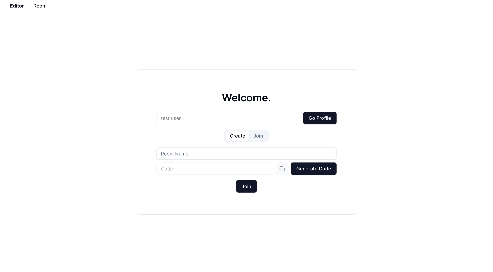
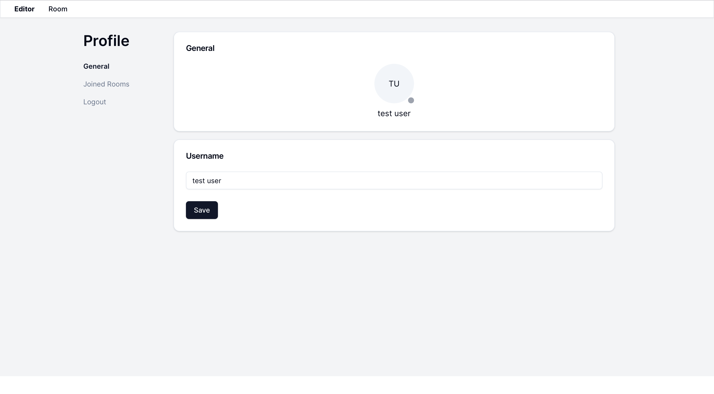
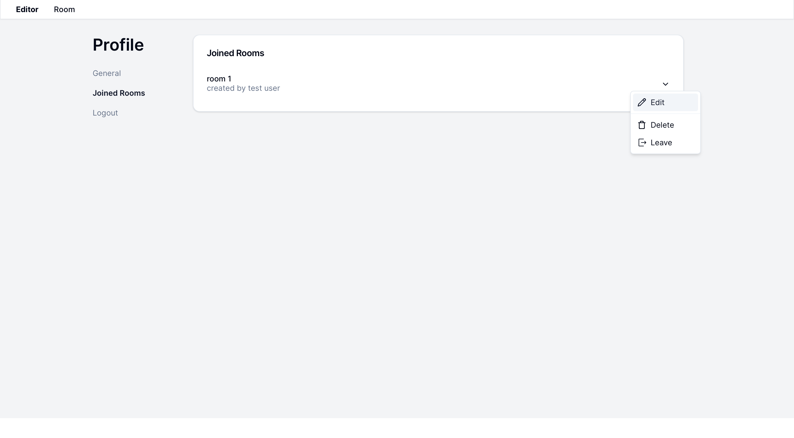
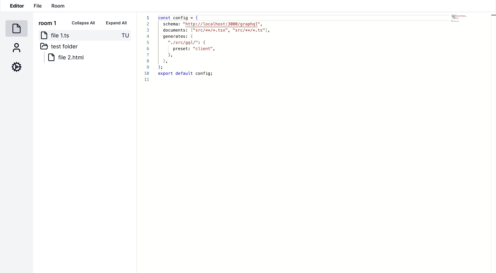
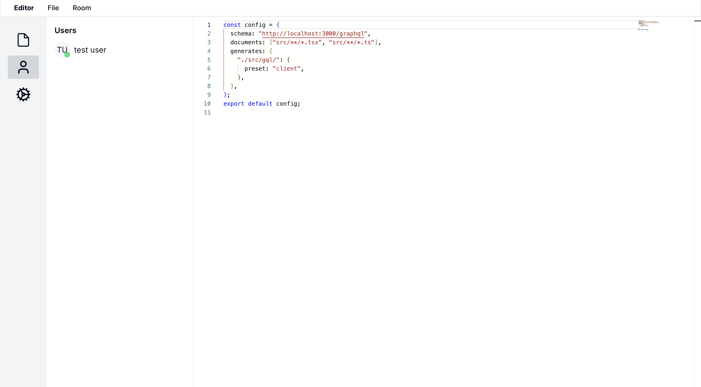

# Realtime Code Editor

A basic realtime code editor that enables users to create temporary accounts and join collaborative "rooms." In these rooms, users can create, modify, and organize files and folders in a shared directory. Changes are synced in real-time, allowing multiple users to edit the same file simultaneously. Users can also view their profiles, manage their rooms, and delete their accounts.

## Features

- **Realtime Collaboration:** Edit files in real-time with other users in shared rooms.
- **Temporary Accounts:** Create temporary accounts for quick access.
- **Room Management:** Create, manage, and delete rooms for different projects.
- **Profile Management:** View and manage your profile and rooms.
- **File Organization:** Create and organize files and folders within rooms.

## Technology Stack

- **Frontend:**
  - [Next.js](https://nextjs.org/)
  - [React.js](https://reactjs.org/)
  - [Shadcn/ui](https://ui.shadcn.com)
  - [GraphQL Apollo](https://www.apollographql.com/)
- **Backend:**
  - [Bun](https://bun.sh/)
  - [GraphQL](https://graphql.org/)
  - GraphQL Subscriptions
  - [GraphQL Apollo](https://www.apollographql.com/)
  - [Pothos GraphQL](https://pothos-graphql.dev)
  - [Prisma](https://www.prisma.io/)
  - [PostgreSQL](https://www.postgresql.org)

## Getting Started

Install the dependancies:

```bash
npm install
# or
yarn install
# or
pnpm install
# or
bun install
```

To run the development server, use one of the following commands:

```bash
npm run dev
# or
yarn dev
# or
pnpm dev
# or
bun dev
```

Then, open [http://localhost:3000](http://localhost:3000) in your browser to see the application.

## Contribution

Feel free to open issues or submit pull requests.

This project is licensed under the MIT License. See the [LICENSE](LICENSE) file for details.

**Note:** This is a basic project intended for learning and experimentation. It is not suitable for production use.

## Screenshots






